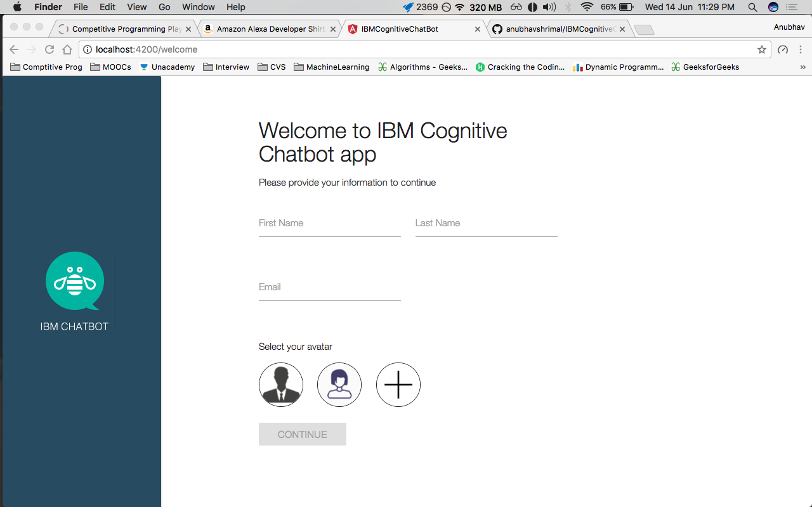

# IBMCognitiveChatBot

Github repository link: https://github.com/anubhavshrimal/IBMCognitiveChatBot

## Commands to run:

- run `npm install` to install all the required node modules.
- run `ng serve -o` for a dev server which will open project in browser.

## Components:
All the components are present in `src/app/components`.

1. **side-banner**:
- Represents the left side banner with IBM Chatbot icon in the middle.
- Tag to use: `<side-banner><side-banner>`
- Added in `styles.css` for offset of the content by the width of the side-banner:
```css
main{
    padding-left: 250px;
}

@media only screen and (max-width : 992px) {
    main{
    padding-left: 0;
    }
}
```

2. **signup**:
- The welcome page asking for details of the user or to select an avatar.
- Tag to use: `<signup></signup>`
- Features:
    - Input validation only in case if no avatar is selected.
    - Validation through [Angular 4 standards](https://angular.io/docs/ts/latest/cookbook/form-validation.html#!#template1).
    - Email validation using [Angular 4 email directive](https://angular.io/docs/ts/latest/api/forms/index/EmailValidator-directive.html).
    - First Name, Last Name fields validations.
    - Avatars array in the component so that multiple avatars can be shown using *ngFor.
    - Material design in input fields and buttons.



3. **chat-page**:
- Add `chat-bar`, `chat-window` and `side-user-profile` components.
- Complete `/chat` page view.

4. **chat-bar**:
- Top menu in chat section.
- Toggles user profile through settings icon.

5. **chat-window**:
- Comprises of chat input field and chat message pane.
- Dynamically adds chat message components of bot and user.

6. **side-user-profile**:  
- Takes `user-data` as input comprising user object of the form:
```javascript
{
    firstName: 'Jackblack',
    lastName: 'Longnamous',
    email: 'jackblack@company.com',
    profilePicture: 'assets/man-avatar.jpg',
    number: '123-244-2446',
    address: {
        line1: '1060 Capp St',
        state: 'San Francisco, CA',
        country: 'USA',
        pin: '94110'
    },
    payment: 'VISA *2446'
}
```
- Fills all the details using the user object passed.

7. **regular-bot-msg**:
- Displays regular message for bot.
- Takes input as `data` for message to be shown.

8. **alert-bot-msg**:
- Displays message with alert message for bot.
- Takes input as `data` of type string for message to be shown.
- Takes input as `alert` of type string for alert to be shown.

9. **actions-bot-msg**:
- Displays message actions or options for bot.
- Takes input as `data` of type string for message to be shown.
- Takes input as `actions` of type Array<string> for actions to be shown.
- Single action in array gives `single-action-bot-msg` component.

10. **regular-user-msg**:
- Displays message for user.
- Takes input as `data` of type string for message to be shown.
- Takes input as `avatar` of type string for user profile picture to be shown.

11. **image-left-user-msg**:
- Displays message with image at left for user.
- Takes input as `data` of type string for message to be shown.
- Takes input as `avatar` of type string for user profile picture to be shown.
- Takes input as `resource` of type string for image to be shown.

12. **image-bottom-user-msg**:
- Displays message with image at bottom for user.
- Takes input as `data` of type string for message to be shown.
- Takes input as `avatar` of type string for user profile picture to be shown.
- Takes input as `resource` of type string for image to be shown.

## Pipes:

1. **capitalize**:
- Makes input message's first letter Uppercase.

This project was generated with [Angular CLI](https://github.com/angular/angular-cli) version 1.0.3.

---------------------------------

## Development server

Run `ng serve` for a dev server. Navigate to `http://localhost:4200/`. The app will automatically reload if you change any of the source files.

## Code scaffolding

Run `ng generate component component-name` to generate a new component. You can also use `ng generate directive|pipe|service|class|module`.

## Build

Run `ng build` to build the project. The build artifacts will be stored in the `dist/` directory. Use the `-prod` flag for a production build.

## Further help

To get more help on the Angular CLI use `ng help` or go check out the [Angular CLI README](https://github.com/angular/angular-cli/blob/master/README.md).
